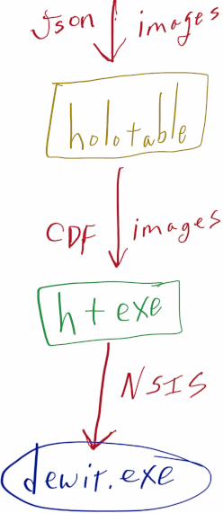

# holotable.exe

* This git repo generates an installer for `holotable.exe`.
* The repository contains the built code for `holotable` and for `GTK`.
* The installer is built using [**NSIS**](https://nsis.sourceforge.io/Main_Page). The installer is defined in `install.nsi`.


## Upstream Triggers

* This repository uses a GitHub action to automatically build the installer.
* The GitHub action is triggered by pushes to the `main` branch.
* Upstream changes to the [`holotable` repository](https://github.com/swccgpc/holotable), _of either card artwork or CDF files,_ will push changes to this _(`holotable.exe`)_ repository which will trigger the GitHub action to build a new installer.



## NSIS Welcome Page Bitmap

* In the `install.nsi` NSIS configuration there is an option to set the welcome page bitmap:
  ```
  !define MUI_WELCOMEFINISHPAGE_BITMAP modern-wizard.bmp
  ```
* The welcome image is installed during the first page of the installer.
  

* The image source is in `modern-wizard.xcf`, a GIMP image format file.
* The file format used by NSIS is a 16-bit BMP file.
* The best way to ensure that the file is compatible with NSIS, is to:
  1. Export from GIMP to BMP.
  2. Use `mspaint.exe` to write the file as a 16-bit BMP file.
  

## Running NSIS locally

### On Ubuntu Linux

* Install NSIS
  ```bash
  apt-get install -y nsis
  ```

* Compile the installer
  ```bash
  makensis install.nsi
  ```

* Test with wine
  ```bash
  wine Holotable-0.9.10-YYYYmm-MMDD.exe
  ```
  


